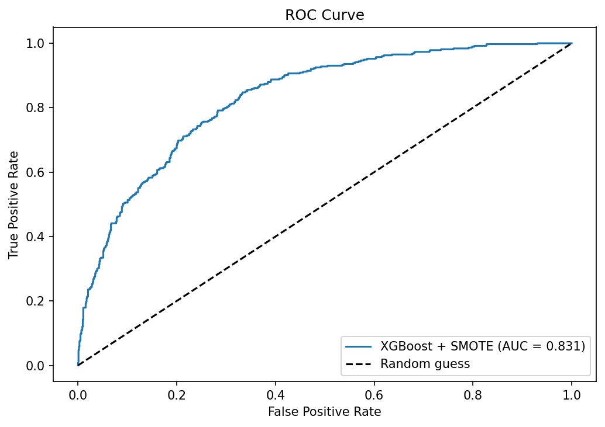
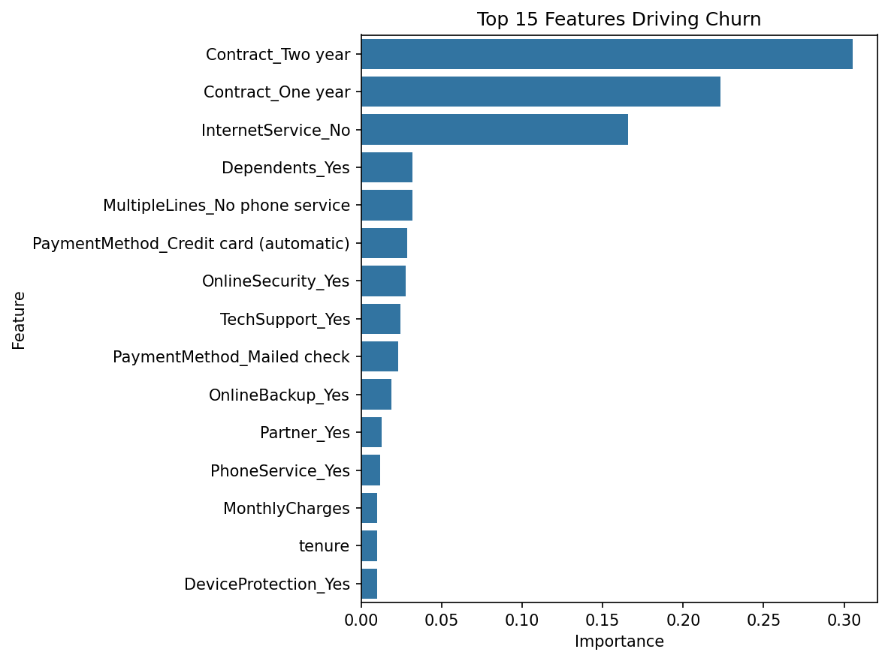

# Customer Churn Prediction

Predicting which Telco customers will cancel their subscription using machine learning, with a focus on **catching churners before they leave**.

## 🎯 Business Problem

Customer churn directly impacts revenue. This project identifies at-risk customers so the business can intervene with retention offers before they cancel.

## 📊 Dataset

- **Source:** [Telco Customer Churn on Kaggle](https://www.kaggle.com/datasets/blastchar/telco-customer-churn)
- **Size:** 7,043 customers, 21 features
- **Target:** Churn (Yes/No) — 26.5% churn rate (imbalanced)

## 🛠️ Tech Stack

- Python 3
- pandas, numpy
- scikit-learn
- XGBoost
- imbalanced-learn (SMOTE)
- matplotlib, seaborn

## 🔍 Approach

1. **Data cleaning** — fixed `TotalCharges` data type, dropped customer ID, encoded target variable
2. **Feature engineering** — one-hot encoded 16 categorical features
3. **Modeling** — compared Logistic Regression, XGBoost, and XGBoost + SMOTE
4. **Class imbalance handling** — applied SMOTE to address 73/27 imbalance
5. **Business interpretation** — analyzed feature importance for actionable recommendations

## 📈 Results

| Model              | ROC-AUC | Recall (Churn) | Precision (Churn) |
|--------------------|---------|----------------|-------------------|
| Logistic Regression| 0.842   | 0.57           | 0.66              |
| XGBoost            | 0.837   | 0.52           | 0.63              |
| **XGBoost + SMOTE**| 0.831   | **0.63**       | 0.55              |

**Final model: XGBoost + SMOTE** — selected because retention cost is low while churn cost is high, so maximizing recall (catching real churners) is more valuable than precision.

### ROC Curve



The model significantly outperforms random guessing (dashed line), with strong separation between classes.

## 💡 Key Business Insights

### Top Features Driving Churn



- **Contract type is the #1 churn driver.** Two-year and one-year contracts together explain over 50% of model predictions.
- **Month-to-month customers are the highest-risk segment** — they have nothing keeping them locked in.
- **Customers without internet service rarely churn** — basic phone-only users are sticky.

## 🎯 Recommended Retention Strategy

Offer 5–10% discounts to convert month-to-month customers to annual contracts. This is likely the highest-ROI retention strategy based on model insights.

## 📁 Project Structure

​```
customer-churn-prediction/
├── README.md
├── requirements.txt
├── Customer Churn Prediction.ipynb
└── outputs/
    ├── churn_predictions.csv
    ├── model_metrics.csv
    ├── feature_importance.csv
    ├── roc_curve.png
    └── feature_importance.png
​```

## 🚀 How to Run

1. Clone this repo
2. `pip install -r requirements.txt`
3. Download the [Telco Customer Churn dataset](https://www.kaggle.com/datasets/blastchar/telco-customer-churn) and place it in `data/`
4. Run `Customer Churn Prediction.ipynb`

## 👤 Author
**Gautam Santosh**

Built as part of an end-to-end data science portfolio focused on real-world business problems.